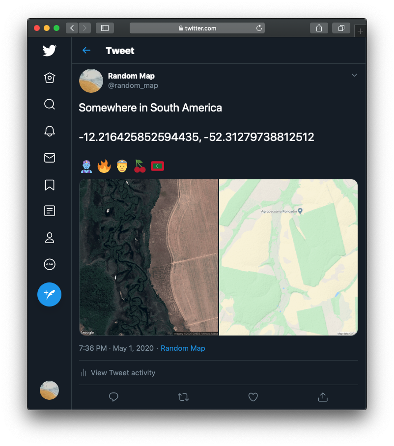

# RandomMap

 

[@random_map](https://twitter.com/random_map) is a Twitter Bot that runs every several hours on a Raspberry Pi and tweets random aerial images of the Earth. Inspired by the [Earth View extension for Google Chrome](https://chrome.google.com/webstore/detail/earth-view-from-google-ea/bhloflhklmhfpedakmangadcdofhnnoh?hl=en). I had a five hour layover and decided to be productive.

# Code
Uses three npm packages:
* twit - Twitter API wrapper for node, used to tweet images
* googlemaps - A Google Static Map API wrapper for generating static aerial images
* node-emoji - Used to add random emojis to tweets :sunglasses: :surfer:
* request - Used to download images
* fs - Used to open image files
* randomFloat - Generates random numbers used to pick a continent to grab an image from

# Future Work
* ~~Oceans cover 71% of the Earth's surface. Unfortunately, pictures of water don't look cool. I need to restrict @random_map from calculating latitude & longitude of oceans.~~ Latitude & longitude is now mostly restricted to land
* More interesting images?
